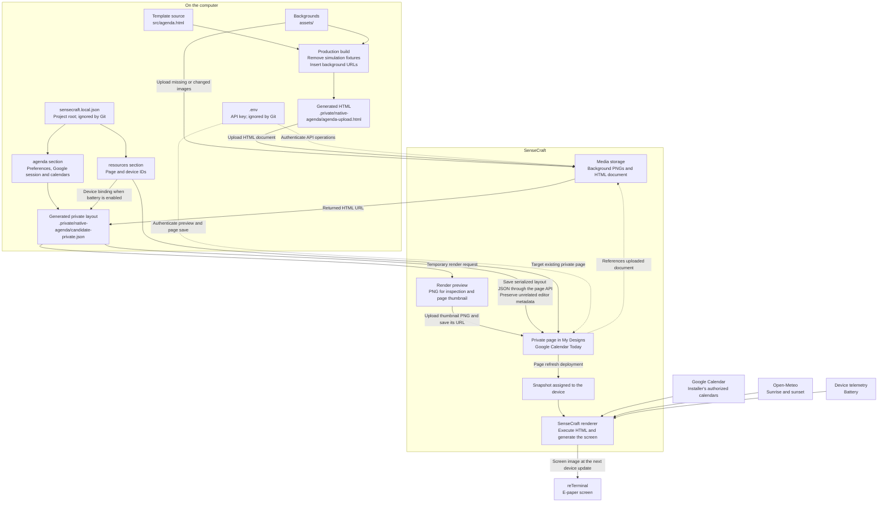

# Private SenseCraft publication workflow

This workflow saves Google Calendar Today as a private workspace page in the
installer's SenseCraft account and assigns it to their device. A reusable
marketplace template is a separate resource and is not required for this path.

## Table of Contents

- [Workflow](#workflow)
- [Local configuration](#local-configuration)
- [Uploaded outputs](#uploaded-outputs)
- [Configuration changes and source changes](#configuration-changes-and-source-changes)
- [Current operational limits](#current-operational-limits)

## Workflow

The diagram follows the implemented build, page configuration and renderer
behavior; saving a newly built layout is a separate operation from uploading it.



## Local configuration

There is one editable installation file, `sensecraft.local.json`, in the
project root. It is excluded by the repository `.gitignore` and has owner-only
permissions. It replaces the previous separate `config.json` and
`private-settings.json` as the authoritative input to all canonical helpers.

|Location|Purpose|
|---|---|
|`sensecraft.local.json` → `agenda`|What to display: chosen calendars, initials/colors, language, city/timezone, backgrounds, intensity and indicators. Includes the authorized Google Calendar session.|
|`sensecraft.local.json` → `resources`|Where to save/deploy: existing workspace `page_id` and `device_id`. `template_id` is a legacy optional target for reusable-template operations, not required by page-only configuration.|
|`.env`|Account `SENSECRAFT_API_KEY`; load into the environment without printing it.|
|`.private/native-agenda/`|Generated HTML/layouts, drafts, cache, previews, readbacks and recovery backups. This directory is not the active configuration location.|
|`sensecraft.local.example.json`|Versionable setup example with placeholders and no account records.|

The previous bootstrap duplicated calendar choices and encoded the Google
session in an event URL. The unified file keeps those values in `agenda` only;
helpers construct API requests from them. Historical private files may remain
as recovery copies but are not read as a fallback.

Start a new local setup from the repository root:

```sh
cp sensecraft.local.example.json sensecraft.local.json
chmod 600 sensecraft.local.json
```

Do not overwrite an existing installation. Populate resource IDs, Google session
and calendar choices privately using the installer's own account. The example
does not perform Google authorization or create SenseCraft resources.

Helpers resolve configuration independently of the current working directory.
`SENSECRAFT_AGENDA_CONFIG` can select another private configuration file;
`SENSECRAFT_AGENDA_STATE_DIR` can select another generated-state directory.
Keep any alternative locations excluded from version control.

The battery key is not stored in the root JSON: helpers supply it from the
environment when constructing the private layout. The resulting private HTML
URL fragment contains Google and, when enabled, battery access bindings.
Those values are transmitted in the account's private page configuration;
they are not embedded in the uploaded HTML source. Generated layouts and
account preview images therefore remain private even though the source is
versionable.

## Uploaded outputs

|Output|How it reaches SenseCraft|
|---|---|
|Background PNGs|Multipart upload through `POST /api/v1/oss/file/upload`, `type=image`; reused from the upload cache when the content hash matches.|
|`agenda-upload.html`|Multipart upload, `type=document`; contains rendering code and uploaded background references, with production fixtures removed.|
|Private layout JSON|Serialized into the page API's `data` field; it is not uploaded as an independent file. Includes the uploaded HTML URL and private configuration fragment.|
|Real page preview PNG|Rendered through `POST /render/preview`, uploaded as `type=thumbnail`; the page stores the returned thumbnail URL.|

There is no ZIP upload of the project. Python scripts, `.env`, the root local
JSON, caches and backup files are not uploaded as files. Required configuration
values are included in the private page payload.

## Configuration changes and source changes

For preference changes on the existing installed page:

```sh
set -a
source .env
set +a
python3 templates/google-calendar-today/scripts/configure.py \
  --set backgroundMode=manual --set theme=floral --set intensity=40 --preview
```

Inspect `.private/native-agenda/configured-preview.png`. Repeat the desired
options with `--save --deploy` to apply them. Preview-only mode does not save
the root configuration or change the installed page. A draft is stored privately
and is not automatically promoted.

For HTML or background changes:

1. Run `build.py --production`; it uploads changed assets and generates layouts.
2. Reconcile the new HTML URL into the existing page layout while preserving
   editor metadata. The build's canonical canvas is not a substitute for all
   existing page metadata.
3. Render and inspect the candidate, then save the private page via API.
4. Deploy a page refresh and compare saved layout with the assigned snapshot.

See [the rebuild runbook](sensecraft-agenda-rebuild.md) for the detailed
restoration sequence and [API field notes](sensecraft-hmi-api.md) for request
contracts and evidence limits.

## Current operational limits

- `build.py` uploads media but does not save the account page or deploy it.
- `configure.py` changes preferences in the HTML URL already saved on the page;
  it does not install a newly compiled document automatically.
- The legacy `persist.py` also updates a reusable template and requires its
  existing ID. Do not use it for a page-only installation after that template
  has been removed; a dedicated page-only persistence path remains a TODO.
- The graphical preferences panel remains unimplemented. The configuration
  contract is supported by the API helper.
- Snapshot equality and deployment acceptance are service-side evidence;
  they do not independently prove that the physical screen has refreshed.
