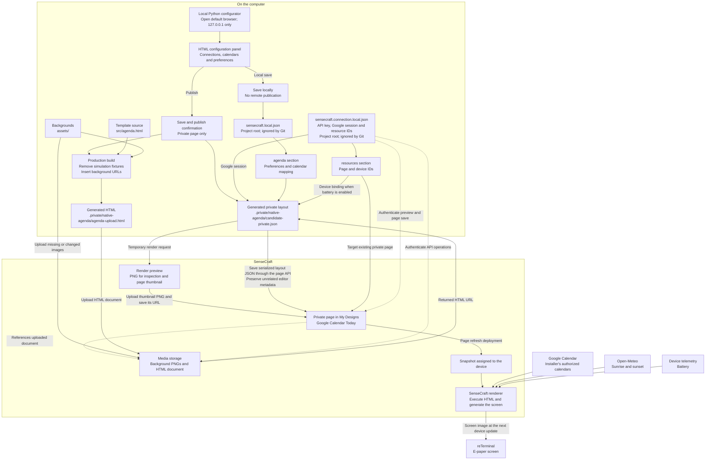

# Private SenseCraft publication workflow

This workflow saves Google Calendar Today as a private workspace page in the
installer's SenseCraft account and assigns it to their device. A reusable
marketplace template is a separate resource and is not required for this path.

## Table of Contents

- [Workflow](#workflow)
- [Local configuration](#local-configuration)
- [Uploaded outputs](#uploaded-outputs)
- [Configuration changes and source changes](#configuration-changes-and-source-changes)
- [Current operational limits](#current-operational-limits)

## Workflow

The diagram follows the implemented build, page configuration and renderer
behavior; saving a newly built layout is a separate operation from uploading it.



## Local configuration

Two durable files in the project root are excluded by Git and use owner-only
permissions. Generated state is disposable.

| Location | Purpose |
| --- | --- |
| `sensecraft.local.json` → `agenda` | Preferences, calendar mapping, colors, language, location, themes and indicators |
| `sensecraft.connection.local.json` | API key, authorized Google session, page/device IDs and durable publication/upload recovery |
| `.env` | Legacy API-key migration source; explicit environment override remains supported |
| `.private/native-agenda/` | Regenerable HTML/layouts, drafts, caches, previews and private backups |
| Root `*.example.json` files | Public-safe configuration examples |

The loader migrates the previous combined root configuration without losing
preferences or valid connections. Do not overwrite an existing installation.
For a new configuration:

```sh
cp sensecraft.local.example.json sensecraft.local.json
cp sensecraft.connection.local.example.json sensecraft.connection.local.json
chmod 600 sensecraft.local.json sensecraft.connection.local.json
```

Populate the installer's own connection and selection privately. These examples
do not perform OAuth or create resources. Deleting `.private/` must not require
recreating valid preferences or authentication; expired/revoked sessions still
require reconnection.

Helpers resolve paths independently of the working directory. Use
`SENSECRAFT_AGENDA_CONFIG`, `SENSECRAFT_AGENDA_CONNECTION` or
`SENSECRAFT_AGENDA_STATE_DIR` only for other excluded private locations.
An explicit `SENSECRAFT_API_KEY` environment value takes precedence over the
connection file; `.env` is a legacy fallback parsed without shell execution.

Google and optional battery bindings travel in the private layout fragment.
They are not embedded in the uploaded HTML source. Account layouts and real
calendar previews remain private; never put their fragments in tracked files.

## Uploaded outputs

|Output|How it reaches SenseCraft|
|---|---|
|Background PNGs|Multipart upload through `POST /api/v1/oss/file/upload`, `type=image`; reused from the upload cache when the content hash matches.|
|`agenda-upload.html`|Multipart upload, `type=document`; contains rendering code and uploaded background references, with production fixtures removed.|
|Private layout JSON|Serialized into the page API's `data` field; it is not uploaded as an independent file. Includes the uploaded HTML URL and private configuration fragment.|
|Real page preview PNG|Rendered through `POST /render/preview`, uploaded as `type=thumbnail`; the page stores the returned thumbnail URL.|

There is no ZIP upload of the project. Python scripts, `.env`, the root configuration
JSON files, caches and backup files are not uploaded as files. Required configuration
values are included in the private page payload.

## Configuration changes and source changes

The preferred interface is the [local configurator](../templates/google-calendar-today/configurator/README.md):

```sh
python3 templates/google-calendar-today/configurator
```

Choose preferences in the panel. Preview renders the unsaved form without
changing the page; Save writes the local configuration; Save and publish
requires confirmation, then saves locally and publishes privately. It uploads
changed source/artwork, creates a page when needed and verifies deployment.
Durable cache/journal/last-success metadata belongs in the connection file;
`.private/` remains disposable. Advanced CLI commands follow.

For preference changes on the existing installed page:

```sh
python3 templates/google-calendar-today/scripts/configure.py \
  --set backgroundMode=manual --set theme=floral --set intensity=40 --preview
```

Inspect `.private/native-agenda/configured-preview.png`. Repeat the desired
options with `--save --deploy` to apply them. Preview-only mode does not save
the root configuration or change the installed page. A draft is stored privately
and is not automatically promoted.

For HTML or background changes:

1. Run `build.py --production`; it uploads changed assets and generates layouts.
2. Use `persist.py --preview-only` to inspect the candidate, then
   `persist.py --deploy` to reconcile the new HTML URL into the fresh page layout,
   preserving editor metadata, render it and save the private page.
3. Refresh the device and compare the assigned snapshot with the saved page.

See [the rebuild runbook](sensecraft-agenda-rebuild.md) for the detailed
restoration sequence and [API field notes](sensecraft-hmi-api.md) for request
contracts and evidence limits.

## Current operational limits

- `build.py` uploads media but does not save the account page or deploy it.
- `configure.py` changes preferences in the HTML URL already saved on the page;
  it does not install a newly compiled document automatically.
- `persist.py` targets only the private page; no reusable template is required
  or recreated. The CLI restoration path still requires an existing page.
- The local graphical configurator supports setup, preferences, native preview
  and private publication. Native SenseCraft inspector controls remain separate.
- Snapshot equality and deployment acceptance are service-side evidence;
  they do not independently prove that the physical screen has refreshed.
