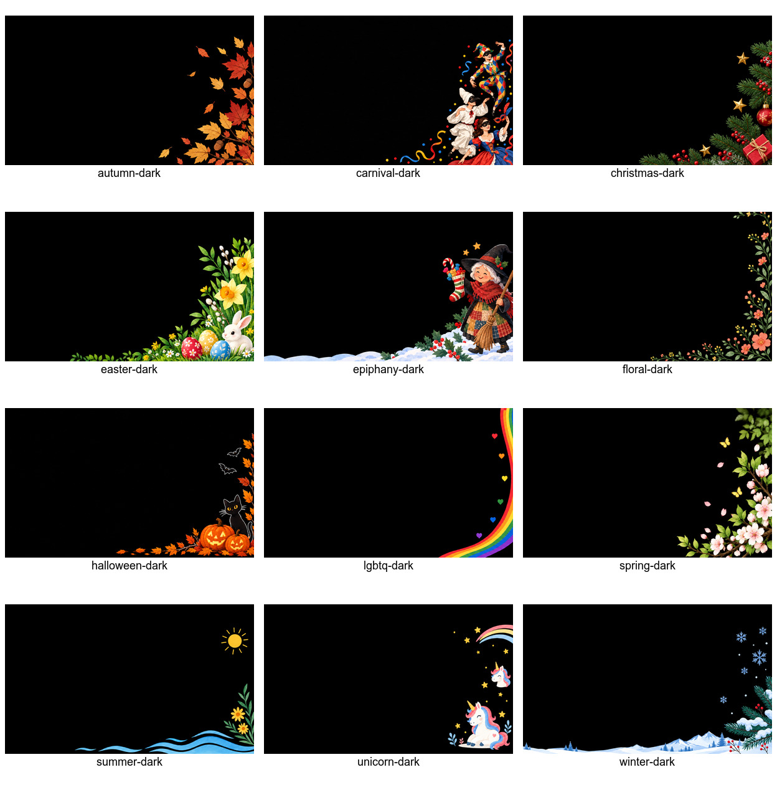
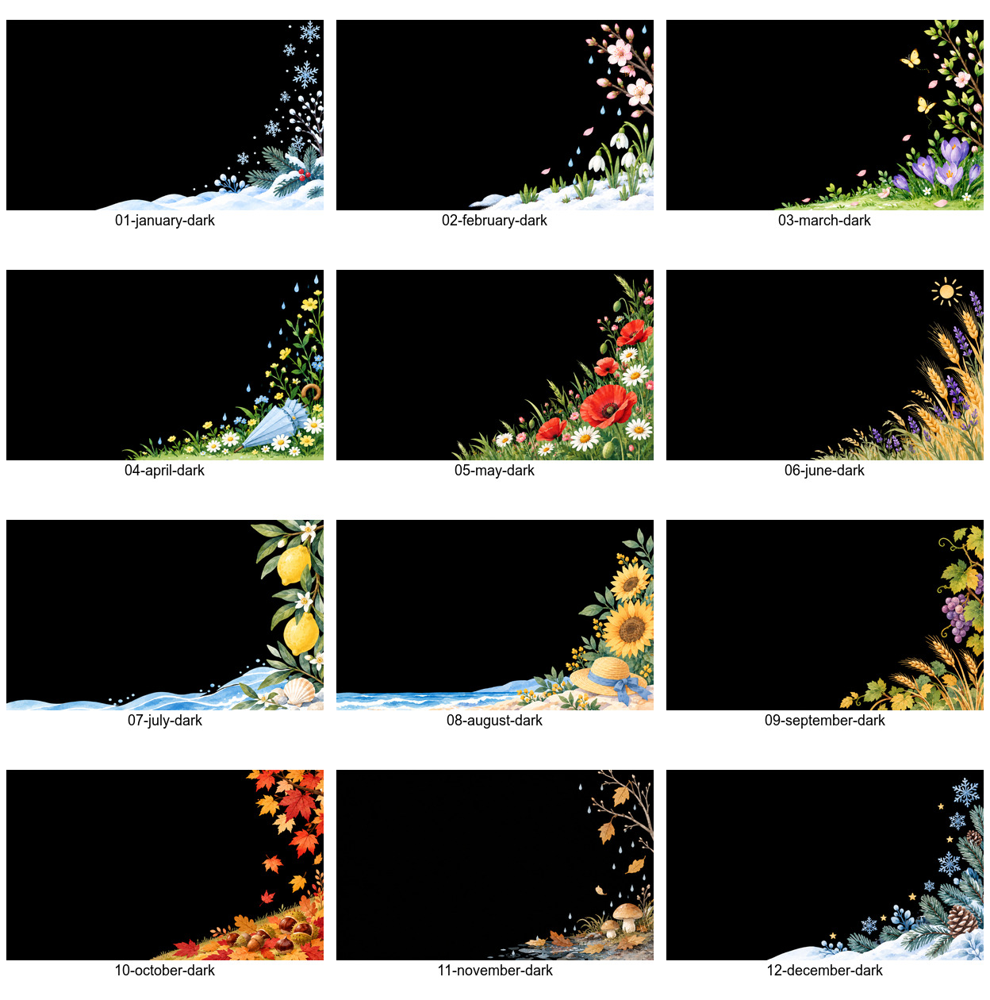

# Sfondi Google Calendar Today

Gli asset finali dell'applicazione sono versionabili in
`templates/google-calendar-today/assets/`. Backup, cache e prove intermedie
restano privati; non sono necessari al runtime.

## Varianti

- Dodici temi: autumn, carnival, christmas, easter, epiphany, floral,
  halloween, lgbtq, spring, summer, unicorn e winter.
- Dodici mensili: da gennaio a dicembre.
- Ogni sfondo chiaro ha un PNG dedicato con suffisso `-dark.png` nella stessa
  directory. Halloween dark conserva la variante esistente.
- Gli sfondi contengono soltanto decorazioni: niente eventi, testo,
  indicatori del calendario o separatori. La miniatura con eventi fittizi
  `assets/thumbnail.png` rimane intenzionalmente distinta.

## Editing e fedeltà

Editing degli originali con lo strumento integrato di immagini. Specifica:
«Sostituire soltanto il fondo chiaro con nero, mantenere posizione, dimensioni,
forme e colori delle illustrazioni; conservare bianchi neve, petali e personaggi;
adattare i bordi al nero; non aggiungere testo, interfaccia o decorazioni».

Gli originali chiari restano invariati durante la creazione delle varianti dark.
Le dimensioni di ciascuna variante coincidono con quelle del corrispondente
chiaro; il runtime le adatta al canvas `800×480`. L'editing non garantisce
identità pixel per pixel dell'artwork: texture e contorni possono differire
leggermente, soprattutto nei dettagli scuri che richiedono contrasto.

## Runtime e cache

`assets/manifest.json` registra SHA-256, `mockup_crop: false` e `dark_variant`.
La build distingue le chiavi mensili chiare da quelle dark, collega ogni
coppia tramite `darkUrl` e conserva il ritaglio soltanto per asset legacy
esplicitamente classificati come mockup. In modalità serale il runtime usa
il PNG dedicato senza inversione CSS; l'inversione resta il fallback per
asset legacy senza variante dark.

La cache usa nome file e SHA-256 effettivo: nuovi PNG hanno nuove chiavi.
Un hash diverso dal manifest interrompe la build. La build effettua upload:
non eseguirla come controllo offline. Questa modifica locale non aggiorna
pagine, template o dispositivi e non introduce nuova evidenza API.

## Anteprime





## Controlli locali

```sh
ruff check templates/google-calendar-today/scripts/build.py
ruff format --check templates/google-calendar-today/scripts/build.py
markdownlint -c "$HOME/.markdownlint.json" docs/sensecraft-theme-backgrounds.md
git diff --check
```

Controllare inoltre sintassi Python e JavaScript, corrispondenza degli hash,
dimensioni delle coppie e assenza di residui tramite ispezione visiva.
Nessun test o comando API è necessario per questi controlli locali.
